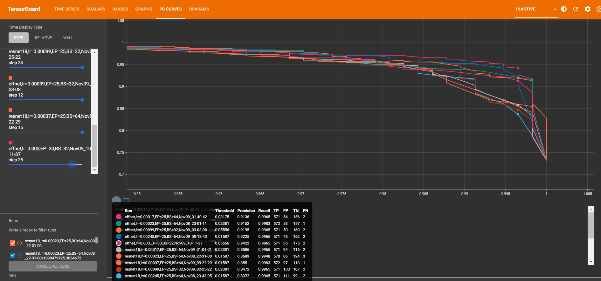

# Deeplify coding challenge - thorax x-ray classification

### Contents:
- `data_exploration.ipynb` - data exploration
- `train_experimental.ipynb` - testing code for training (not necessary, only for transparency)
- `train.py` - script for training the models
- `test.ipynb` - notebook for evaluating the final model on the test set
- `main.py` - script for the FastAPI API
- `runs` - folder of TensorFlow logs

### To run the code:
- Install the required packages in `requirements.txt` in a Python environment using Python 3.10.6.
- To start training:
  - Select one of the training routines at the end of the file by uncommenting it.
  - Run `python -m src.train` or `python -W ignore::UserWarning -m src.train` to ignore torchaudio warnings.
- To see the training results in real-time and afterwards:
  - Run `tensorboard --logdir runs` to start TensorBoard.
  - Open the given address with your browser to use TensorBoard.
- To start the API:
  - To access the API, start a *uvicorn* server by running `uvicorn src.main:app --reload`.
  - Open the given address with your browser to use the API.
  - Note: Classifing the first image takes a few seconds.

### Comments:
- **Data science related:**
  - Note that only some of the saved models are uploaded to git due to storage space.
  - Takeaways from data_exploration:
    - The images vary in size a lot -> 600x500 might be a good size as input.
    - 25% of the images are 'normal,' and 75% are 'pneumonia.'
    - There is additional information in the file names: 35% of the pneumonia cases are due to virus infections, 65% are due to bacterial infections.
  - The training resources were limited, as Google Colab was not reliable, and I only have my budget laptop. So I decided to use a model pretrained on ImageNet. Training only the newly attached classification head was the most feasible approach, given the hardware. I tried three different models: ConvNExt Tiny, ResNet18, EfficientNetB0. ConvNExt was too big and, therefore, training was too slow. EfficientNet proved to be faster and more performant.
  - The training runs were logged in TensorBoard to have nice visualizations of loss, accuracy, F1-score on train and validation data, confusion matrices, graph_view to inspect the architecture, and a precision-recall curve in order to choose a threshold with respect to the desired precision-recall tradeoff. As shown in the image below, the model with learning rate 0.003 dominates the precision-recall of the other runs in some parts, but the F1-score is not better. The thresholds in these areas are quite small.
  - A random search for the hyperparameters batch size and learning rate was conducted. With more computational resources, other hyperparameters like the size of the layers in the classification head and dropout rate could be added, and larger batch sizes would be feasible.
  - After a quick research, I decided not to train the model given the final set of hyperparameters on the combined train and validation set. Even though there are mixed opinions on the topic, I prefer to have the validation for determining a threshold given the validation precision-recall curve.
 
  - Things to improve:
    - More data augmentation like using different saturations, which usually works well with X-ray images.
    - Training the model from scratch using a larger input size, possibly larger batch sizes.
    - Train a larger, more performant model, as no real overfitting was witnessed, so the model could be designed to have some more complexity or simply longer training.
    - take the distribution of the pneumonia cases into consideration
- **API related:**
  - The route `/files` takes an image, classifies it, and returns a JSON response, including the labeled image, the classification, and the confidence score.
  
